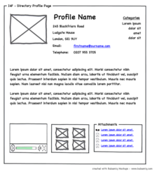

## Prerequisites
-   None

## Objectives
-   Draw simple wireframes to mock up a web page.

## Sketching and Wireframing

### What Is a Wireframe?

A **wireframe** is an image that sketches out the layout of major pieces of content within a page, without all of the fully-rendered detail that might be present in an illustration.

Although making detailed, feature-rich wireframes is typically the province of the UX/UI designer, even developers can produce basic layout sketches, and these sketches are extremely useful in the planning process as a tool to clarify and codify your vision. They also segue easily into mocking up a site with boxes, so that you know how to actually build your layout.

### Wireframing in WDI

Within the scope of this course, we will not be expecting you to produce designer-level wireframes; however, we _will_ expect you to produce low-fidelity sketches for your projects. A low-fidelity wireframe or sketch is simple -- just complex enough to convey the gist of the page -- and may feature minimal text, placeholders for images, or skeletons of interactive features like drop-down menus and pop-ups or modals.

It should usually not concern itself with things like:
*   color scheme
*   fonts
*   specific content (images, written copy, etc)
*   animations and timing

If you find yourself diving into those details, you may be going too deep. The purpose of a sketch is to be light, flexible, and even disposable if necessary.

Below are some examples of sketches submitted in previous cohorts. Some are higher fidelity and some are lower; some were drawn by hand and some were drawn using design tools like Balsamiq; however, **any** of the following would be considered acceptable wireframes for a project.

[Compact](images/compact.png)

[MBTA](images/mbta.png)

[CrossHatch](images/crosshatch.jpg)

[Timeline](images/timeline.png)

[Art City](https://github.com/breduffy/ArtCity_app/blob/master/z_Mockups/Project%202_Art_City_Mockups.pdf)

> The last one is pretty high-fidelity, and is the kind of wireframe you'd typically see from a designer; that is not our expectation from you in WDI.

In general, since hand-drawn wireframes are easier to iterate on and maintain than computer-drawn ones, we recommend that in the scope of this course, you do all your wireframing by hand.

#### Lab

Individually, pick one of the eight following sites and draw a basic sketch for the site on a patch of whiteboard. Focus on capturing the key elements of layout for the page, but **DO NOT INCLUDE ANY REAL TEXT**. When you're finished, rotate within your squads (A->B, B->C, etc.) and see if you can identify your teammate's site using only their sketch. Then, take a few minutes and give each other feedback on the sketches, specifically pointing out aspects that were more clear or less clear.

*   [Wikipedia](https://en.wikipedia.org)
*   [NYtimes.com](http://www.nytimes.com/)
*   [Reddit](https://www.reddit.com/)
*   [Google](https://www.google.com/)
*   [ESPN.com](http://espn.go.com/)
*   [TripAdvisor](http://www.tripadvisor.com/)
*   [City of Boston](http://www.cityofboston.gov/)
*   [JCrew](https://www.jcrew.com/index.jsp)

### Resources

*   [Moqups](https://moqups.com/), a mostly-free drag and drop wireframing web app
*   [Balsamiq](https://balsamiq.com/), a sketching tool for making high-fidelity wireframes
*   [Wirify](http://www.wirify.com/), a tool that draws up rudimentary wireframes for existing sites.

### [License](LICENSE)

1.  All content is licensed under a CC­BY­NC­SA 4.0 license.
1.  All software code is licensed under GNU GPLv3. For commercial use or
   alternative licensing, please contact legal@ga.co.
